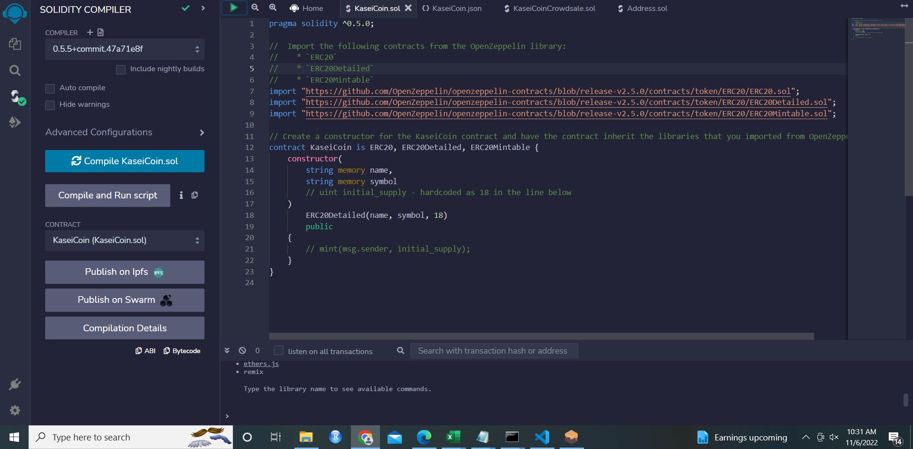
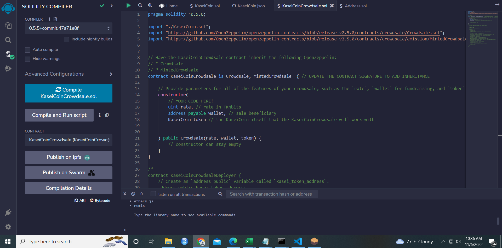
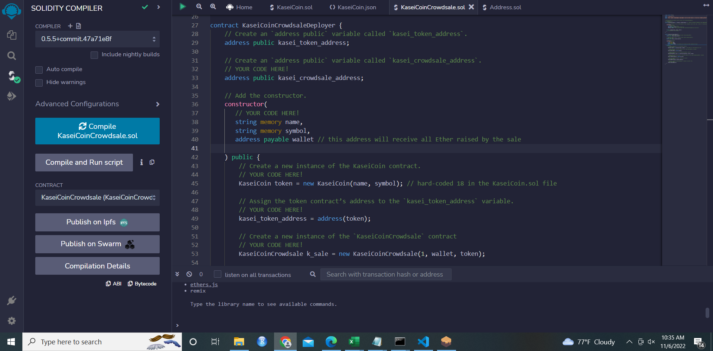
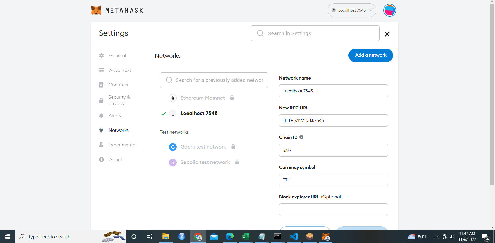
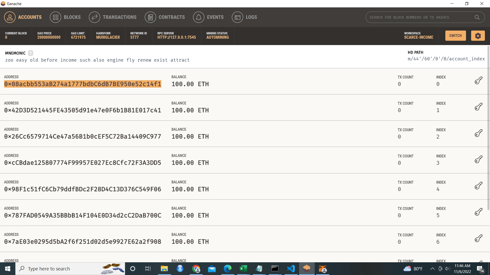
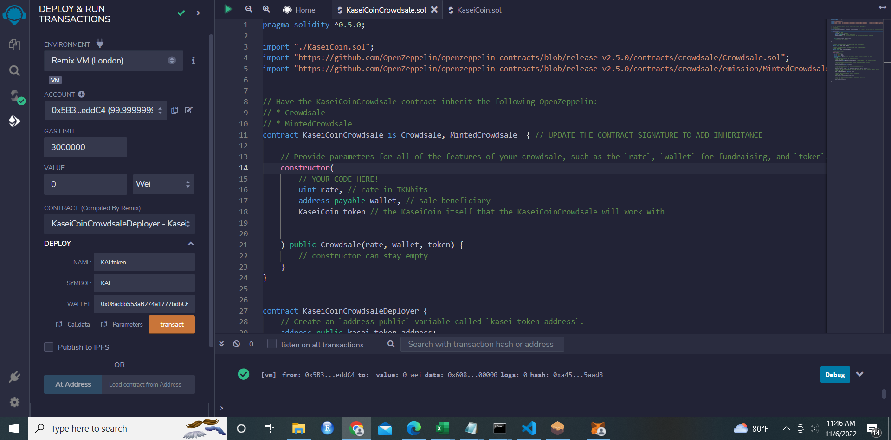
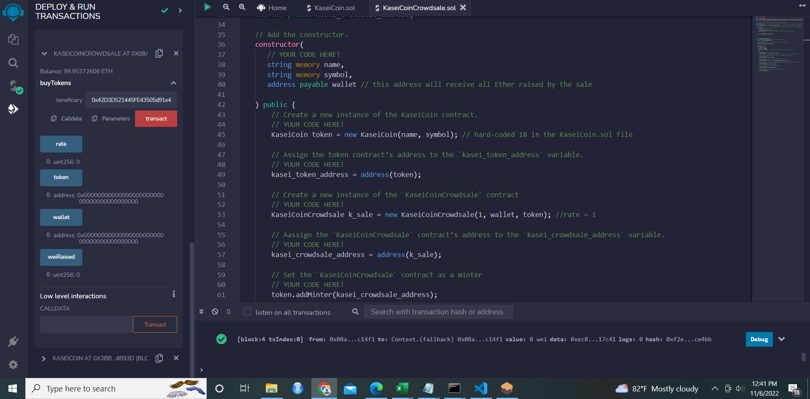

# KaseiCoin Crowdsale Smart Contracts with Remix

These files create a fungible token (ERC-20 compliant) that is minted using a 'Crowdsale' contract from the OpenZeppelin Solidity library. 

The crowdsale contract that is created allows the user to manage the entire crowdsale process, allowing the user to send ether to the contract and receive KaseiCoin tokens (KAI) in return. The contract mints the tokens automatically and distributes them to buyers in one transaction. 

## Installation Guide

Downloading the code & associated files using `git clone` from the repository is sufficient to download the Jupyter Notebook, ensure that the associated libaries (see Technologies section) are installed on your machine as well.  

# Functions

The screenshots in the 'Screenshots' folder demonstrate the successful build and deployment of the functions in the smart contracts: 

The successful build of KaseiCoin.sol: 

The successful build of KaseiCoinCrowdsale (prior to creating the deployment contract):

The successful build of KaseiCoinCrowdsale (including deployment contract):

With Ganache running on your computer and the Metamask extension, update the Metamask settings to run on local host and import an acccount address into Metamask as the following screenshots show: 

After selecting the CrowdsaleDeployer smart contract and specifying parameters for name, symbol, and wallet, you can click 'deploy' to deploy the contract:

You are then able to access the buyTokens function, and after specifying a wallet address and clicking 'transact' you are able to buy tokens: 

## Usage

Logging on to the [REMIX IDE](https://remix.ethereum.org), you should be able to copy and paste the files 'KaseiCoin.sol' and 'KaseiCoinCrowdsale.sol' into your workspace, build, and deploy the contract with relative ease. Ensure that you have Ganache and Metamask set up to test the contracts locally.

## Contributors

Project contributors are the Rice FinTech bootcamp program team (instructor Eric Cadena) who developed the tasks for this project along with myself (Paula K) who's written the code in the workbook.
